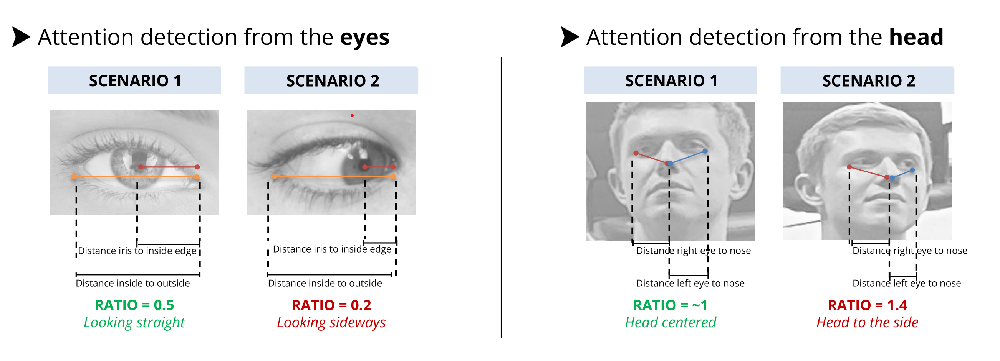

# The Attention Meter Project

The Attention Meter project is a data science project that was developed during a 2-weeks summer bootcamp at Le Wagon. The project utilizes pre-trained computer vision models to analyze facial attributes of an audience during a presentation, in order to measure their attention and engagement. By doing so, the Attention Meter project enables you to identify the strengths and weaknesses of your presentation flow.


## Objectives

The main objectives of the Attention Meter project are:

- Measure the attention and engagement of an audience during a presentation.
- Capture individualized attention insights.


## Possible Use Cases

The Attention Meter project has several possible use cases, such as:

- Conducting A/B testing on presentation format and content.
- Identifying highlights and downlights of a keynote or presentation to improve it.
- Measuring the attention span of an audience to adapt presentation cadence.


## General Principle

The general principle of the Attention Meter project is that a person's attention can be extrapolated from their facial attributes. This includes the orientation of their face, such as facing the presenter versus having their head down, and the direction of their gaze, such as looking straight towards the presenter versus looking sideways or down.

By using pre-trained computer vision models to analyze these facial attributes, the Attention Meter project provides valuable insights into the attention and engagement of an audience during a presentation.


## How it works:

The Attention Meter uses a 3-step approach to measure the attention of an audience based on an  image recording of said audience:

1. **Face detection:** The Mediapipe face detection model is used to detect faces on the image of the audience. Each face is then cropped to be further analyzed.

   Note: For better face detection results, notably when people are far from the camera, the original image of the audience is split into multiple crops (i.e., creating zooms of the original image) on which the Mediapipe face detection can perform better

2. **Landmark detection:** On each face, the Mediapipe facemesh model is used to detect face landmarks (478 landmarks, including iris).

3. **Face ratios calculations:** We perform geometry-based calculations on the face landmarks. Calculating ratios and using experience-based thresholds we can determine if someone is looking at the presentation or not. For example, we can use the ratio $distance\ iris-eye\_edge / eye\_length$ to infer if someone is looking straight or is looking sideways.



In addition to it, we run a face recognition model (from Adam Geitgey) in order to inidividualize the attention results to each known person in the audience.

The output of the Attention Meter project is a dataframe that holds the prediction result (i.e., whether someone is attentive or not) and the results of all relevant calculated ratios for each face detected by the model, frame by frame.


## Limitations

The Attention Meter project has a number of limitations, including:

- Camera capture configuration and room setup can affect the results. For example, someone at the edge of the room may have his face/gaze oriented to the side while actively looking at the presenter/presentation. In some cases, that person may be wrongly identified as unattentive.
- Specificities of facial features mean that face ratios may vary from person to person
- Image resolution and definition need to be very high for the facemesh model to detect landmarks precisely, especially for people sitting in the back.
- High computational power is required to run the model, particularly when analyzing a large number of faces


## Potential Developments

There are several potential developments for the Attention Meter project, including:

- Fine-tuning to improve the detection accuracy for specific room setups, such as adjusting thresholds, taking into account different zones within the audience image, and applying machine learning algorithms based on labelled audience photos.
- Implementing a face/person tracking approach instead of relying solely on face recognition to provide individualised insights.


## How to Get Started

### Requirements

- Python 3.10.6+
- Pyenv and pyev-virtualenv extension (for automatic creation of project environment with Make command - not critical)

### Installation

1. Set up the local environment and install the package using the Makefile functions:
   - `make install_env`: set up your local environment (uses pyenv with Python 3.10.6)
   - `make install_package`: install the local project directory as an editable package
2. Store input video or frames in the relevant folder in the`attention_data/00_inputs` directory.
3. Run the `workflow` notebook to generate the outputs - saved in folders of the `attention_data/99_outputs` directory.

### Repo structure

```bash
├── Makefile							# Main project interface: prepare the environment, manage data sources and run the complete workflow
├── README.md
├── requirements.txt
├── setup.py
├── attention							# Contains the entire code logic for this package
│   └── interface
│       ├── __init__.py
│       └── main_local.py			# Packages the key methods to run the overall workflow: from video to frame encoding to generating the outputs
│   ├── models
│   │   └── face_models.py  	   # Contains all the logic for face and landmarks detection as well as resulting attention measurement; also contains the methods enabling face recognition
│   ├── img_proc
│   │   ├── __init__.py
│   │   ├── img_annot.py			# Set of functions to show the results of each image processing step directly on the image (for checking the outputs and finetuning the models)
│   │   ├── img_split.py			# Contains the logic for splitting an image into multiple crops and remerging crops together
│   │   └── landmark_manip.py		# Contains a set of methods to manipulate landmarks coordinates
│   ├── utils
│   │   ├── __init__.py
│   │   └── img_vid_utils.py		# Set of utilities for video and image manipulation
│   │   ├── dataframe_utils.py	# Set of utilities for output dataframe processing
│   │   ├── img_plot.py				# Image plotting functions
│   ├── params.py						# Contains global variables: directory path logic, Mediapipe face_mesh landmarks indices, image split parameters, output dataframe skeleton
├── attention_data					# Directory for storing input video/frames and software outputs
│   ├── 00_inputs
│   └── 99_outputs
└── notebooks
    ├── 00_workflow.ipynb			# Notebook detailing the complete software workflow
    └── 01_img_split.ipynb			# Notebook showcasing how the image split feature works
```


## Video of Final Project Presentation

For more information, please refer to our project presentation video: https://youtu.be/MS5pu9YHVzk
